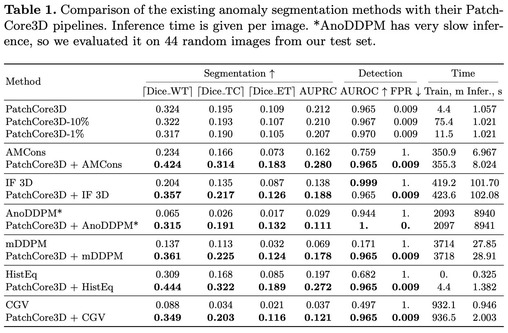
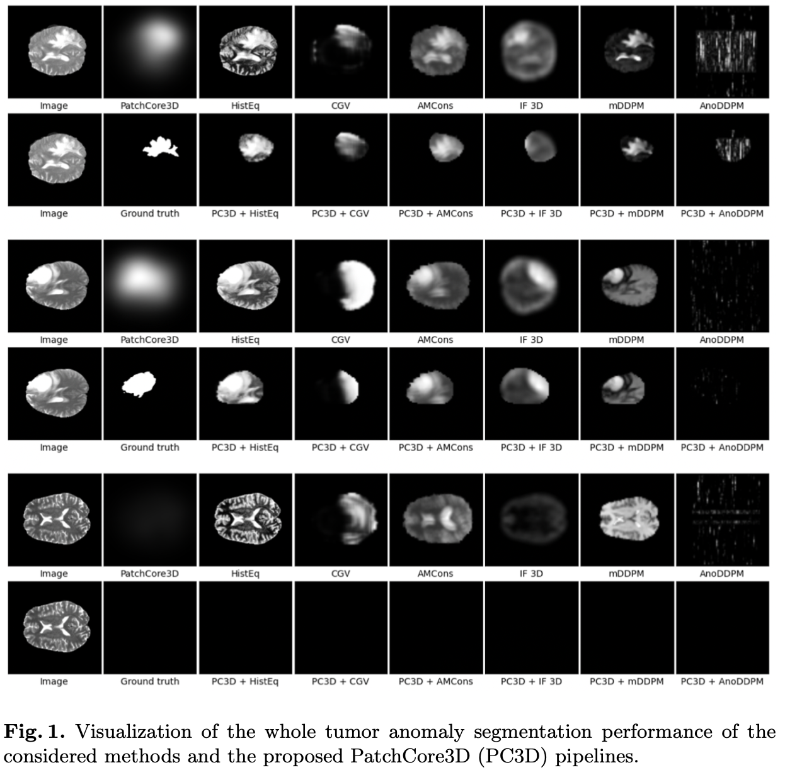

# Feature-Based Pipeline for Improving Unsupervised Anomaly Segmentation on Medical Images

This repository contains the implementation for the paper 'Feature-Based Pipeline for Improving Unsupervised Anomaly Segmentation on Medical Images'. 

The main results of the paper:


Visualization of the predictions of PatchCore3D and PatchCore3D pipelines compared to other methods.


This repo uses code from: 
1. <https://github.com/amazon-science/patchcore-inspection> with basic PatchCore method implementation;
2. <https://github.com/jusiro/constrained_anomaly_segmentation/> with AMCons implementation;
3. <https://github.com/Duplums/yAwareContrastiveLearning> with a 3D DenseNet121 implementation;
4. <https://github.com/2na-97/CGV_MOOD2022> with CGV implementation, but we slightly modified the code in order to run it (the initial version is not runnable).
5. <https://github.com/snavalm/ifl_unsup_anom_det> with IF 3D implementation (we added new dataloader for our data).
6. <https://github.com/hasan1292/mDDPM> with mDDPM implementation (we added new dataloader for our data).
7. <https://github.com/Julian-Wyatt/AnoDDPM> with AnoDDPM implementation (we added new dataloader for our data).

## Installation instructions
First, clone this repository and install the requirements. Then, set the `PYTHONPATH` environment variable:
```shell
git clone https://github.com/SubmissionAnonym/PatchCore3D.git
cd PatchCore3D
pip install -e .
env PYTHONPATH=src python bin/run_patchcore.py
```

## Data downloading and preprocessing
You can request access and download BraTS2021 dataset here: <http://braintumorsegmentation.org/>. 
Download IXI dataset (T1 and T2 images) (<http://brain-development.org/ixi-dataset/>). Then, run the preprocessing pipeline for IXI images:

1. Co-registration to the same anatomical template SRI24 and resampling to a uniform isotropicresolution with CaPTk toolkit. Firstly, install CaPTk following the installation instructions <https://cbica.github.io/CaPTk/Installation.html>. Then, you need to specify correct paths to downloaded and unzipped IXI T1 and T2 images (`t1_data_path` and `t2_data_path`) as long as output path to preprocessed files (`final_path`) and path to the installed CaPTk (`path_to_captk`). Then, run the script with 
`python bin/preproc_ixi.py`.

2. Skull-stripping with HD-BET. You need to install HD-BET <https://github.com/MIC-DKFZ/HD-BET>. Then, run the skull-stripping process, passing `final_path` from the previous step. In a `preprocessed_ixi_path` there would be data that would be used further in all experiments.
```shell
hd-bet -i <final_path> -o <preprocessed_ixi_path> -mode fast -tta 0
```

### Reproducing PatchCore experiments

1. Download weights of the pre-trained DenseNet121 model from this repository: <https://github.com/Duplums/yAwareContrastiveLearning>. This model is used as a patch feature extractor.

2. To reproduce results with Mahalanobis distance scorer, run `train_mahalanobis.sh`, having previously specified correct paths to the datasets and to a downloaded pretrained model inside.

3. To reproduce PatchCore3D-1% result, run `train_patchcore.sh`, having previously specified correct paths to the datasets and to a downloaded pretrained model inside. You can vary `sampler` arguments to get another coreset subsampling percentage (eg. `sampler -p 0.1 approx_greedy_coreset`) or PatchCore3D-100% without sampling (`sampler identity`) or random sampling (`sampler -p 0.01 random`). To get results for different tumor subregions one need to vary `--tumor_type` argument.

#### Reproducing AMCons experiment

1. Prepare data for training and save it to `dir_out_datasets` with the following command.
```shell
python bin/preproc_data_amcons.py --dir_dataset_brats <brats_path> --dir_dataset_ixi <preprocessed_ixi_path> --ixi_ids_split_file ixi_ids.json --dir_out <dir_out_datasets> --scan t2 --nSlices 5
```
2. Train the model and save predictions to `dir_with_results`.
```shell
python bin/amcons.py --dir_out <dir_with_results> --method camCons --learning_rate 0.0001 --wkl 10 --wH 0.1 --dir_datasets <dir_out_datasets> --device cuda:0 --save_segmentation_results False --load_weigths True --only_test True
```
3. Compute metrics passing `dir_with_results` as an argument:
```shell
python bin/calc_metrics_amcons.py --log_project project --log_group amcons --saved_predictions_path <dir_with_results> <results_path> dataset --test_size 0.2 <preprocessed_ixi_path> <brats_path>
```

#### Reproducing HistEq experiment
Results can be reproduced by providing correct paths to datasets in `hist_equalization.sh` and running this script.

#### Reproducing CGV experiment

1. Run the unsupervised pre-training process. You need to create paths `path_to_save_pretrained_best_model_weights` and `path_to_save_pretrained_checkpoints` beforehand.
```shell
python src/patchcore3d/cgv/train.py --dataset <preprocessed_ixi_path> --gpu <gpu_device_no> --weight <path_to_save_pretrained_best_model_weights> --checkpoints <path_to_save_pretrained_checkpoints> --pretrain --epoches 10
```
2. Train the model using previously obtained `path_to_save_pretrained_checkpoints`.
```shell
python src/patchcore3d/cgv/train.py --dataset <preprocessed_ixi_path> --gpu <gpu_device_no> --weight <path_to_save_final_best_model_weights> --checkpoints <path_to_save_final_checkpoints> --pretrained_checkpoint_path <path_to_save_pretrained_checkpoints>
```
3. Save sample-level and pixel-level predictions varying argument `--e sample` and `--e pixel`. You need to specify `save_predictions_path`. Also, you need to provide `test_ids_path` (you can find `test_ids.json` file in the patchcore experiment folder).
```shell
python src/patchcore3d/cgv/pred.py --e sample --o <save_predictions_path> --gpu <gpu_device_no> --model_path <path_to_save_final_checkpoints> --ixi_path <preprocessed_ixi_path> --brats_path <brats_path> --test_ids_path <test_ids_path>
```

4. Compute anomaly detection metrics again for `--e sample` and `--e pixel`.
```shell
python src/patchcore3d/cgv/eval_sample_level.py --pred <save_predictions_path>
```

5. Compute anomaly segmentation metrics.
```shell
python bin/calc_metrics_amcons.py --log_project project --log_group cgv --saved_predictions_path <save_predictions_path>/pixel --no_sample_level_metrics <results_path> dataset --test_size 0.2 <preprocessed_ixi_path> <brats_path>
```

#### Reproducing IF 3D experiment
You should follow the instructions provided in the initial repo.

1. Preprocess the data (both IXI and BraTS2021):
```shell
python extract_and_preproc_brains.py --dataset <IXI or BraTS> --source <root directory of Brats2021 / IXI (already preprocessed earlier)> --target <directory to store pre-processed dataset> --res full --cluster_centers <path to pix_cluster_centers_brain.cp (file with the k-Means cluster centers)> --mode_pool 2
```

2. Train the model. You need to provide the correct to preprocessed in stage 1 IXI data in specs.json. Then, you need to put it into the experiment folder `<experiment directory>`.
```shell
python train_network.py --experiment <experiment directory>
```

3. Save predictions using `evaluation.ipynb`. You need only to provide correct path to model and data.

#### Reproducing mDDPM experiment

Follow all the instructions provided in the original repo <https://github.com/hasan1292/mDDPM>. You only do not need to preprocess the data again (it is already preprocessed in the similar way for all our experiments).

#### Reproducing AnoDDPM experiment
1. Provide correct paths to datasets in `diffusion_training.py`.

2. To train, run 
```shell
python3 diffusion_training.py 0
```

3. Save predictions. Note that one scan is processed more than two hours.
```shell
python3 detection.py 0 ixi
python3 detection.py 0 brats
```

#### Reproducing Pipeline PatchCore3D + <METHOD> experiment

1. Obtain pipeline predictions passing predictions of PatchCore3D (stored in the folder with experiments `patchcore_exp`) and your chosen method. There is an optional argument `--threshold`, that is used for binarization of patchcore anomaly segmentation maps. By default, they are taken from the `results.csv` file of PatchCore3D experiment. However, optimal thresholds vary for different tumor subregions, so be careful to pass the correct one.
```shell
python bin/merge_pipeline_stage_predictions.py --patchcore_experiment_folder <patchcore_exp> --second_stage_preds_path <method_preds_folder> --output_path <pipeline_preds_path>
```
2. Compute anomaly segmentation metrics (anomaly detection peformance is the same as for PatchCore3D).
```shell
python bin/calc_metrics_amcons.py --log_project project --log_group pipeline --saved_predictions_path <pipeline_preds_path> --no_sample_level_metrics <results_path> dataset --test_size 0.2 <preprocessed_ixi_path> <brats_path>
```