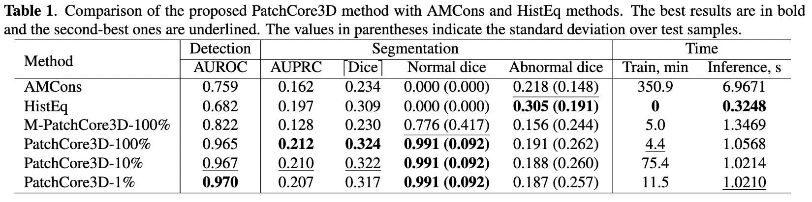
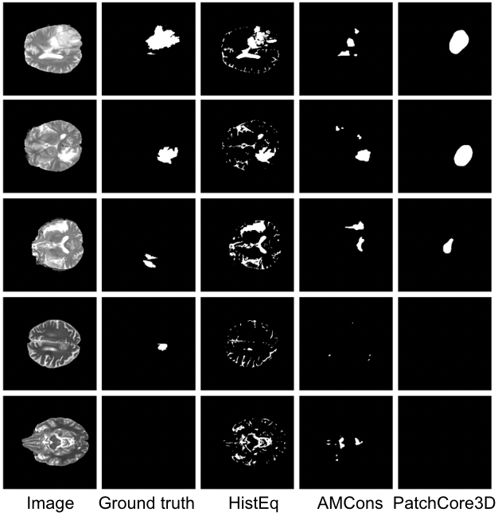

# Feature-based detection and segmentation of anomalies for medical images using a pre-trained model

This repository contains the implementation for the paper 'Feature-based detection and segmentation of anomalies for medical images using a pre-trained model'. 

The main results of the paper:


Visualization of the predictions of PatchCore3D compared to other methods.


This repo uses code from: 
1. <https://github.com/amazon-science/patchcore-inspection> with basic PatchCore method implementation;
2. <https://github.com/jusiro/constrained_anomaly_segmentation/> with AMCons implementation;
3. <https://github.com/Duplums/yAwareContrastiveLearning> with a 3D DenseNet121 implementation.

## Installation instructions
First, clone this repository and install the requirements. Then, set the `PYTHONPATH` environment variable:
```shell
git clone https://github.com/SubmissionAnonym/PatchCore3D.git
cd PatchCore3D
pip install -e .
env PYTHONPATH=src python bin/run_patchcore.py
```

## Data downloading and preprocessing
You can request access and download BraTS2021 dataset here: <http://braintumorsegmentation.org/>. 
Download IXI dataset (T1 and T2 images) (<http://brain-development.org/ixi-dataset/>). Then, run the preprocessing pipeline for IXI images:

1. Co-registration to the same anatomical template SRI24 and resampling to a uniform isotropicresolution with CaPTk toolkit. Firstly, install CaPTk following the installation instructions <https://cbica.github.io/CaPTk/Installation.html>. Then, you need to specify correct paths to downloaded and unzipped IXI T1 and T2 images (`t1_data_path` and `t2_data_path`) as long as output path to preprocessed files (`final_path`) and path to the installed CaPTk (`path_to_captk`). Then, run the script with 
`python bin/preproc_ixi.py`.

2. Skull-stripping with HD-BET. You need to install HD-BET <https://github.com/MIC-DKFZ/HD-BET>. Then, run the skull-stripping process, passing `final_path` from the previous step. In a `preprocessed_ixi_path` there would be data that would be used further in all experiments.
```shell
hd-bet -i <final_path> -o <preprocessed_ixi_path> -mode fast -tta 0
```

### Reproducing PatchCore experiments

1. Download weights of the pre-trained DenseNet121 model from this repository: <https://github.com/Duplums/yAwareContrastiveLearning>. This model is used as a patch feature extractor.

2. To reproduce results with Mahalanobis distance scorer, run `train_mahalanobis.sh`, having previously specified correct paths to the datasets and to a downloaded pretrained model inside.

3. To reproduce PatchCore3D-1% result, run `train_patchcore.sh`, having previously specified correct paths to the datasets and to a downloaded pretrained model inside. You can vary `sampler` arguments to get another coreset subsampling percentage (eg. `sampler -p 0.1 approx_greedy_coreset`) or PatchCore3D-100% without sampling (`sampler identity`) or random sampling (`sampler -p 0.01 random`).

#### Reproducing AMCons experiment

1. Prepare data for training and save it to `dir_out_datasets` with the following command.
```shell
python bin/preproc_data_amcons.py --dir_dataset_brats <brats_path> --dir_dataset_ixi <preprocessed_ixi_path> --ixi_ids_split_file ixi_ids.json --dir_out <dir_out_datasets> --scan t2 --nSlices 5
```
2. Train the model and save predictions to `dir_with_results`.
```shell
python bin/amcons.py --dir_out <dir_with_results> --method camCons --learning_rate 0.0001 --wkl 10 --wH 0.1 --dir_datasets <dir_out_datasets> --device cuda:0 --save_segmentation_results False --load_weigths True --only_test True
```
3. Compute metrics passing `dir_with_results` as an argument:
```shell
python bin/calc_metrics_amcons.py --log_project project --log_group amcons --saved_predictions_path <dir_with_results> <results_path> dataset --test_size 0.2 <preprocessed_ixi_path> <brats_path>
```

#### Reproducing HistEq experiment
Results can be reproduced by providing correct paths to datasets in `hist_equalization.sh` and running this script.
